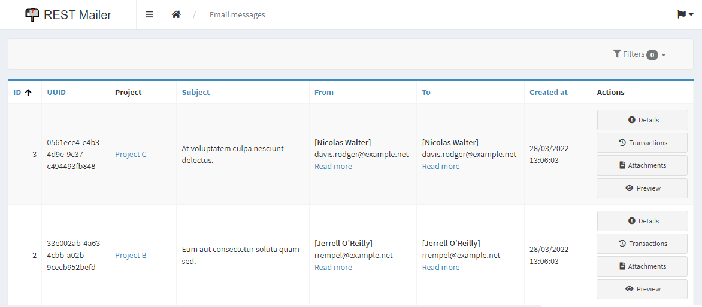
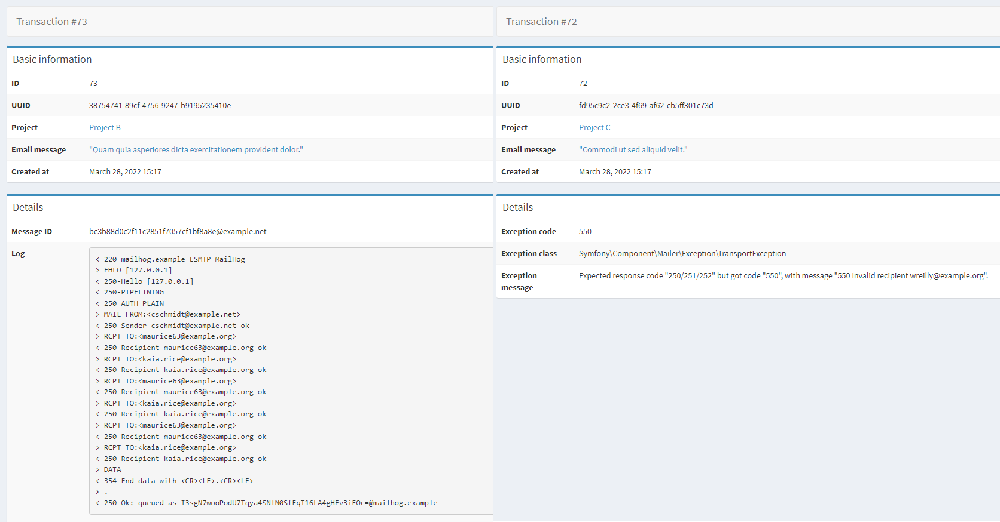
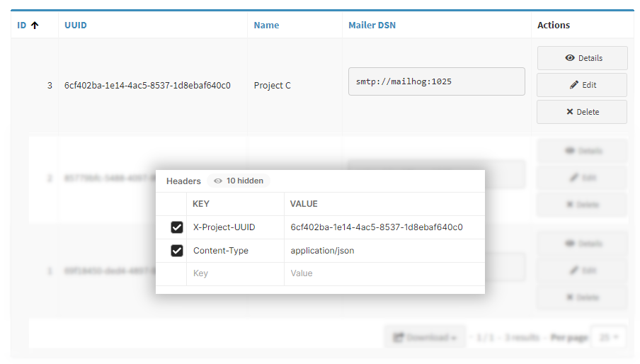
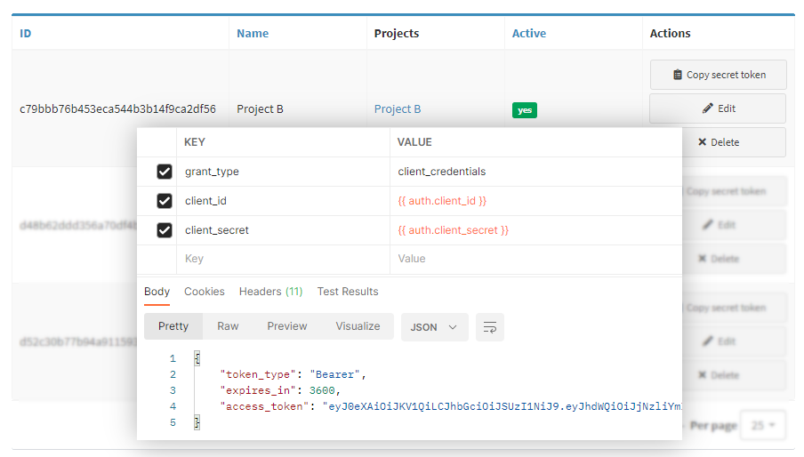

# REST Mailer

_Send emails using simple HTTP requests._

Emails sent through this application are available to render & preview in the browser.   
This includes their attachments, both attached (classic way) and embedded (using [RFC-2392 Content-ID](https://datatracker.ietf.org/doc/html/rfc2392)).

Emails are sent asynchronously, and each send attempt (named _transaction_) is stored in the system, available to preview in the browser. 
This includes details about occurred exceptions when something goes wrong, as well as Message-ID and SMTP log on success.

## Features

**Asynchronous**

_AMQP? Redis? Use whatever you need._

Queue & message handling is provided by [Symfony Messenger](https://symfony.com/doc/current/messenger.html),
which means you can fully customize the transport (AMQP, Redis etc.) and have full control over the workers (supervisor-friendly, graceful shutdown support). 

**Scoping**

_Multiple projects connected to the service? No problem._

Projects (_scopes_) can be defined in the panel, each holding their own transport configuration. 
Simply provide project UUID in request headers while sending a message, and association will be stored.

**OAuth 2.0**

_Authentication method you already know and use._

API requires authentication using [OAuth 2.0](https://oauth.net/2/) standard. 
Tokens generated by the clients are visible in the panel, and can be manually removed or revoked. 
Each project (_scope_) can have multiple authentication clients.

**Various transport support**

Emails are sent using the [Symfony Mailer](https://symfony.com/doc/current/mailer.html), which means that every transport supported by the mailer is automatically supported here.
This includes built-in transports (`smtp`, `sendmail` and `native`) and 3rd party ones, such as Amazon SES, MailChimp and many more.

List of all supported transports can be found [here](https://symfony.com/doc/current/mailer.html#transport-setup).

## License

The MIT License (MIT). Please see [license file](LICENSE) for more information.
